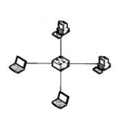
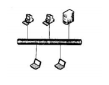
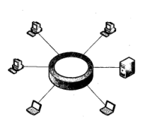
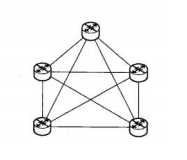
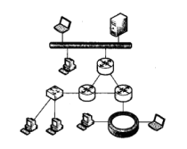

# 第一章 计算机网络概述
---
## [第一节] 计算机网络基本概念

### 1.  `计算机网络的起源`

>  从技术范畴上来看，计算机网络是计算机技术(通信) 技术相互融合的产物

### 2. `计算机网络的定义`

> 计算机网络是 ***互连的、自治的计算机*** 的集合。
> - `自治`: 指互连的计算机系统彼此独立，不存在主从或者控制与被控制的关系
> - `互连`: 指利用通信链路连接相互独立的计算机系统

### 3. `协议`

> 协议是网络通信实体之间在数据交换过程中需要遵循的规则或约定，是计算机网络有序运行的重要保证  
> 协议三要素 : ***语义、语法、时序***
>
>  - `语义`: 定义实体之间交换的信息中需要发送控制信息。
>  - `语法`：定义实体之间交换信息的格式与结构。

### 4. `计算机网络的功能`

> 硬件资源共享：云计算、云储存  
> 软件资源共享：Saas   
> 信息资源共享：信息检索

### 5. `计算机网络的分类`

> #### ① 按覆盖范围分类
> - `个域网 PAN`: 随身穿戴设备、便携设备通过无线技术构成的小范围网络，如蓝牙手表蓝牙耳机和手机
> - `局域网 LAN`: 通常部署在办公室、办公楼、厂区、校区等局部区域内
> - `城域网 MAN`: 覆盖一个城市范围的网络
> - `广域网 WAN`: 覆盖范围在几十到几千千米，可以实现异地城域网或局域网的互连   

> #### ② 按拓扑结构分类
> - `星型拓扑结构`:  
优点：易于监控与管理、故障诊断与隔离容易  
缺点：中央节点是网络的瓶颈，一旦故障，全网瘫痪，网络规模受限于中央节点的端口数量  

> - `总线型拓扑结构`:  
优点：结构简单，所需电缆数量少，易于扩展
缺点：通信范围受限，故障诊断和隔离较困难，容易产生冲突

> - `环形拓扑结构`:  
优点：所需电缆长度短，可以使用光纤，不容易冲突
缺点：某节点的故障容易引起全网瘫痪, 新节点的接入或撤出过程比较麻烦，存在等待时间问题  

> - `网状拓扑结构`:  
优点：网络可靠性高，一条或多条链路故障时，网络仍然可用
缺点：网络结构复杂，造价成本高，选路协议复杂

> - `树形拓扑结构`:  
优点：易于扩展，故障隔离容易
缺点：对根节点的可靠性要求高，一旦根节点故障，则可能导致网络大范围瘫痪

> - `混合拓扑结构`:  
优点：易于扩展，可以构建不同规模网络，并可以根据需要优选网络结构
缺点：网络结构复杂，不易管理和维护

> #### ③ 按交换方式分类
> - 电路交换网络 
> - 报文交换网络
> - 分组交换网络

> #### ④ 按网络用户属性分类
> - `公用网`: 由国家或企业出资建设，面向公众提供收费或免费服务的网络，例如 电信网络   
> - `私有网`: 由某个组织出资建设，专门面向该组织内部业务提供网络专属服务，不向公众开放。例如银行、军事、铁路专用网 