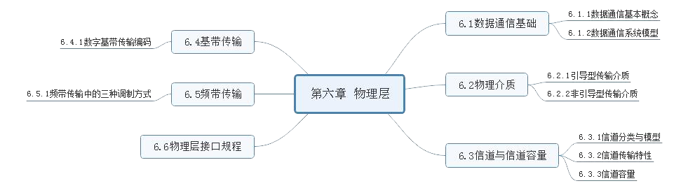
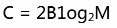
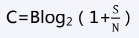

# 第六章 物理层

---
## [第一节] 数据通信基础
### 1. `数据通信基本概念`
1. 消息与信息: 信息是消息中包含的有意义的内容
2. 通信: 能够实现通信功能的各种技术、设备和方法的总体
3. 信号: 信息在传输通道中传播的载体
4. 数据: 对客观事物的性质状态以及相互关系等进行记载的符号及其组合
5. 信道: 信号传输的介质

### 2. `数据通信系统模型`
1. 数据通信系统的构成: 信源、发送设备、信道、信宿、噪声
2. 模拟通信和数字通信
    - 模拟信号是指信号的因变量完全随连续消息的变化而变化的信号。模拟信号的因变量一定是连续的;
    - 数字信号是指表示消息的因变量是离散的,自变量时间的取值也是离散的信号,数字信号的因变量的状态是有限的;

3. 数据通信方式
    - 按传输方向分类
        - 单向通信(单工): 任何时间都只能有一个方向的通信,而没有反方向的交互。
        - 双向交替通信(半双工): 通信的双方都可以发送信息, 但不能双方同时发送或接收,如对讲机
        - 双向同时通信(全双工): 通信双方可以同时收发消息
    - 二进制传输时空顺序:
        - 并行通信: 为一个字节的每一位(bit)都设置一个传输通道, 全部位(bit)同时进行传送
        - 串行通信: 只为信息传输设置一条通道(适用于长距离传输)
    - 按发送和接收步调:
        - 异步通信: 以字符为单位单独发送
        - 同步通信: 以数据库为单位进行发送
---
## [第二节] 物理控制
### 1. `引导型传输介质`
架空明线、双绞线、同轴电缆、光纤

### 2. `非引导型传输介质`
地波传输、天波传输、视线传输

---

## [第三节] 信道与信道容量
### 1. `信道分类与模型`
- 调制信道: 调制信道是指信号从调制器的输出端传输到调制器的输入端经过的部分
- 编码信道: 编码信道是指数字信号由编码器输出端到译码器输入端经过的部分,包括其中的所有变换装置与传输介质
### 2. `信道传输特性`
信道类别: 传输特性  
恒参信道:
1. 对信号幅值产生固定的衰减
2. 对信号输出产生固定的时延

随参信道:
1. 信号的传输衰减随时间随机变化
2. 信号的传输时延随时间随机变化
3. 存在多径传播现象

### 3. `信道容量`
- 奈奎斯特公式, 给出了理想无噪声信道的容量: 
> C 为信道容量, 单位为 bit/s 或 bps; B 为信道带宽,单位为 Hz; M 为进制数, 即信号状态数
- 香农公式给出连续信道的信道容量为:

- 离散信道容量: 每个符号能传输的最大平均信息量和单位时间内能够传输的最大平均信息量

## [第四节] 基带传输
### 1. `数字基带传输编码`
数字基带信号码:  
- 单级不归零码: 脉冲幅值要么是正电平、要么是零电平, 只有一个极性,在整个脉冲持续时间内, 电平保持不变, 且脉冲持续期结束时也不要求必须回归零电平
- 双极不归零码: 脉冲幅值要么是正电平、要么是负电平,在整个脉冲持续时间内, 电平保持不变, 且脉冲持续期结束时也不要求必须回归零电平
- 单极归零码: 与单极不归零码不同的是, 在每个正脉冲持续期的中间时刻, 电平要回到零电平
- 双极归零码: 与双极不归零码不同的是, 在每个正、负脉冲持续期的中间时刻, 电平要回到零电平
- 差分码: 差分码又称相对码, 利用电平的变化与否来表示信息

数字基带传输码:
- AMI 码: 信息码中的 0 为 AMI 传输码中的 0; 信号码中的 1 交替编码为 AMI 传输码中的 +1 和 -1
- 双相码: 又称曼彻斯特码。正(高)电平跳到负(低)电平表示 1, 负电平跳到正电平表示 0, 相当于信息码中 1 为双极非归零码的 10, 信息码中 0 为双极非归零码的 01。  
双相码的另一种码型是差分双相码,也成为差分曼彻斯特码。利用每位开始处是否存在电平跳变编码信息。其中, 开始处有跳变表示 1, 无跳变表示0
- 米勒码:  
    1. 信息码中的 1 编码为双极非归零码的 01 或者 10
    2. 信息码连 1 时,后面的 1 要交替编码;
    3. 信息码中的 0 编码为双极非归零码的 00 或 11
    4. 信息码单个 0 时, 其前沿、中间时刻、后沿均不跳变
    5. 信息码连 0 时, 两个 0 码元的间隔跳变,即前一个 0 的后沿跳变

- CMI 码: 信息码的 0 编码为双极非归零码的 01; 信息码的 1 交替编码为双极非归零码的 11 和 00
- nBmB 码: 将 n 位码映射为 m 位, m>n, 从 2^m 个码中选出 2^n 个有效码, 获得良好的编码性能。
---
## [第五节] 频带传输
### 1. `频带传输中的三种调制方式`
1. 二进制数字调制
    - 二进制幅移键控: 根据二进制基带信号电平的高低, 控制载波信号选择两种不同的幅值
    - 二进制频移键控: 根据二进制基带数字信号控制或选择输出一段(与码元持续时间相同)频率为 f1 或 f2 载波信号
    - 二进制相移键控: 根据二进制基带信号电平的高低, 控制载波信号选择两种不同的相位
    - 二进制差分相移键控: 利用相邻两个码元载波间的相对相位变化表示数字基带信号的数字信息

2. 多进制数字调制: 多进制数字调制是二进制数字调制的扩展, 是利用多进制数字基带信号去调制载波信号的特征参数
3. 正交幅值调制: QAM 是二维调制技术, 对载波信号的幅值和相位同时进行调制的联合调制技术。

## [第六节] 物理层接口规程
### 1. `物理层接口特性`
1. 机械特性: 也叫物理特性, 指明通信实体间硬件连接接口的机械特点
2. 电气特性: 规定了在物理连接上, 导线的电气连接及有关电路的特性
3. 功能特性: 指明物理接口各条信号线的用途,包括接口信号线功能的规定方法以及接口信号线的功能分类
4. 规程特性: 即通信协议, 指明利用接口传输比特流的全过程, 以及各项用于传输的事件发生的合法顺序, 包括事件的执行顺序和数据传输方式, 即在物理连接建立、维持和交换信息时, DTE、DCE 双方在各自电路上的动作序列等。