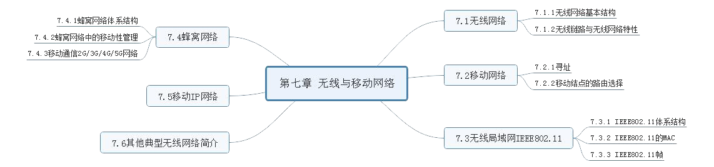
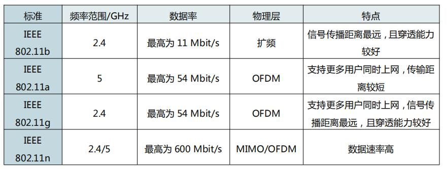

# 第七章 无线与移动网络

---
## [第一节] 无线网络
### 1. `无线网络基本结构`
1. 无线网络主要包括: 无线主机、无线链路、基站、网络基础设施
2. 无线主机不通过基站(即没有基站), AdHoc 网络中的每个节点都兼有路由器和主机两种功能

### 2. `无线链路与无线网络特性`
无线链路有别于有线链路主要表现在以下方面
- 信号强度的衰减
- 干扰
- 多径传播

---
## [第二节] 移动网络
无线网络不一定是移动网络, 但移动网络一定是无线网络。移动网络中的移动节点是随时间改变其与网络连接位置的节点, 并且移动采用无线通信技术。
### 1. `寻址`
- 外部网络可以通过向所有其他网络发通告, 告诉它们该移动节点正在它的网络中
- 将移动网络功能从网络核心搬到网络边缘, 由该移动节点的归属网络来实现

### 2. `移动节点的路由选择`
直接路由选择和间接路由选择

---

## [第三节] 无线局域网 IEEE802.11

IEEE802.11 标准的共同特征:
1. 都使用相同的介质访问控制协议 CSMA/CA
2. 链路层帧使用相同的帧格式
3. 都具有降低传输速率以传输更远距离的能力
4. 都支持 ”基础设施模式“ 和 ”自组织模式“

### 1. `IEEE802.11 体系结构`
基站和基本服务集
### 2. `IEEE802.11 的 MAC`
IEEE802.11 的 MAC 协议采用 CSMA/CA 协议  
IEEE802.11 使用链路层确认/重传(ARQ)方案

### 3. `IEEE802.11 帧`
IEEE802.11帧共有 3 种类型, 控制帧、数据帧和管理帧  
IEEE802.11 数据帧结构: MAC 首部 30 字节、帧主体、尾部
---
## [第四节] 蜂窝网络
### 1. `蜂窝网络体系结构`
第二代蜂窝移动通信2G 的代表性体制是 GSM 系统, 采用的是 FDMA(频分多址) 和 TDMA(时分多址) 混合接入的方式  
第三代蜂窝移动通信 3G 系统中最关键的技术是无线传输技术。 除了卫星接口技术外, 被分为 CDMA(码分多址) 和 TDMA(时分多址) 两大类, 其中 CDMA 占主导地位

### 2. `蜂窝网络中的移动性管理`
GSM 标准采用了一种间接路由选择方法管理移动性。 GSM 的归属网络维护一个称作归属位置注册器的数据库, GSM 的被访网络维护一个称作访问者注册位置注册器的数据库

### 3. `移动通信 2G/3G/4G/5G 网络`
|  类别   | 技术  | 特征|
|  ----  | ----  | --- |
| 2G  | FDMA/TDMA | 移动电话系统的开端, 分为承载业务、电信业务、附加业务
| 3G  | CDMA/TDMA | 全球统一频谱、标准,无缝覆盖, 更高频谱效率和系统容量, 服务质量优、保密强、适应多种环境
| 4G  | LTE 系统 | 高速率传输、智能化、业务多样化、无缝接入、向后兼容、经济

---
## [第五节] 移动 IP 网络
移动 IP 标准由 3 部分组成
- 代理发现
- 向归属代理注册
- 数据报的间接路由选择
---
## [第六节] 其他典型无线网络简介
- WiMax: 全球微波互联接入称为 IEEE802.16 标准, 目的是在更大范围内为用户提供可以媲美有线网络的无线通信解决方案
- 蓝牙: IEEE802.15.1 网络以小范围、低功率和低成本运行
- ZigBee: IEEE 第二个个人区域网络标准是 IEEE802.15.4, 称为 ZigBee, 主要以低功率、低数据速率、低工作周期应用为目标