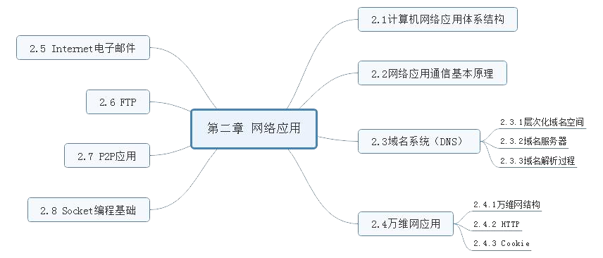
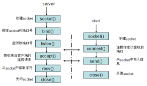

# 第二章 计算机网络概述

---
## [第一节] 计算机网络应用体系结构
> 客户/服务器(C/S)结构网络应用:
> - 特点: 最典型、最基本,通信只在客户与服务器之间进行。
> - 案例: www应用、文件传输 FTP、 电子邮件  

> 纯 P2P 结构网络应用:
> - 特点: 所有通信都在对等的通行方之间直接进行。
> - 案例: Gnutella、BitTorent

> 混合结构网络应用:
> - 特点: 存在客户与服务器之间传统 C/S 结构的通信, 也存在客户之间的通信
> - 案例: IPTV

---
## [第二节] 网络应用通信基本原理

> 典型的网络应用编程接口是套接字, 标识套接字的编号叫端口号,IP地址用于唯一标识一个主机或路由器接口  
> Internet 传输层能提供的服务只有两类: 面向连接的可靠字节流传输服务 TCP 和 无连接不可靠数据报传输服务 UDP
---
## [第三节] 域名系统(DNS)

### 1. `层次化域名空间`

> ① 国家顶级域名: cn、us、uk
> ② 通用顶级域名: com、net、org、edu、gov
> ③ 基础结构域名: arpa

### 2. `域名服务器`

> ① 根域名服务器: 最重要的域名服务器,知道所有的顶级域名服务器的域名和 IP。  
> 在因特网上共有 13 个不同 IP 地址的根域名服务器,它们的名字是用一个英文字母命名,从 a 一直到 m (前 13 个字母), 如 a.rootservers.net  
> ② 顶级域名服务器  
> ③ 权威域名服务器  
> ④ 中间域名服务器

### 3. `域名解析过程`
> 递归解析: 依次查询
> 迭代解析: 直接响应结果
---
## [第四节] 万维网应用 

### 1. `万维网结构`

> Web应用主要包括 Web 服务器、浏览器与超文本传输协议(HTTP)等部分  
HTML 通过 URL 地址引用页面中的其他对象  
每个 URL 地址主要由两部分组成: 主机域名和对象路径名

### 2. `HTTP`  
> HTTP 概述: Web 应用的应用层协议。定义浏览器如何向 Web 服务器发送请求以及 Web 服务器如何向浏览器进行响应  

> HTTP 连接:   
> - 非持久连接: 每次请求一个对象都需要新建立一个 TCP 连接  
> - 并行连接: 建立多条并行 TCP 连接,并行发送 HTTP 请求和并行接收 HTTP 响应。  
> - 持久连接: 
>   - 非流水方式持久连接:收到前一个响应后再发出下一个请求报文
>   - 流水式持久连接: 收到前一个响应前,依次发送后续对象请求

> HTTP报文  
> - 组成: 起始行、首部行、空白行、实体主体  
> - 分类:
>   - 请求报文:  
起始行<方法>< URL ><协议版本>  
HTTP 典型的请求方法有 GET、HEAD、POST、OPTION、PUT 等  
>   - 响应报文:  
起始行<协议版本><状态码><短语>  
100 ~ 199: 信息提示  
200 ~ 299: 成功  
300 ~ 399: 重定向  
400 ~ 499: 客户端错误  
500 ~ 599: 服务器错误

### 3. `cookie`
> Cookie 中文名称为小型文本文件, Cookie 是由服务器生成。Cookie 是实现服务器对客户端状态的跟踪技术  
主要包括 4 部分:
>- HTTP 响应报文中的 Cookie 头行
>- 用户浏览器在本地储存、维护和管理的 Cookie 文件
>- HTTP 请求报文中的 Cookie 头行
>- 网站在后台数据库中存储、维护 Cookie 信息

---
## [第五节] Internet 电子邮件

### 1. `邮件服务器`
> 功能是发送和接收邮件,向发信人报告邮件传送情况,是电子邮件体系结构的核心。

### 2. `简单邮件传输协议 SMTP`
> 特点:
> - 只能传送 7 位 ASCII 码文本内容(多用途互联网邮件扩展 MIME 定义了将非 7 位 ASCII 码内容转换为 7 位的编码规则)
>- 传送的邮件内容不能包含 `CRLF.CRLF`
>- SMTP 是 “推动协议”
>- SMTP 使用 TCP 连接是持久的  

> 发送过程: 握手阶段、邮件传输阶段、关闭阶段  

### 3. `邮件读取协议`
> POP3: 使用传输层 TCP。POP3 协议交互过程可以分为 3 个阶段:授权、事务处理和更新  
> IMAP: IMAP 服务器维护了 IMAP 会话的用户状态信息,允许用户代理只读邮件的部分内容  
> HTTP: HTTP 是 Web 邮件系统的邮件读取协议

---

## [第六节] FTP
> 定义: 在互联网的两个主机间实现文件互传的网络应用, 其应用层协议也称为 FTP, 默认端口号 21  
> 特点: 
>- FTP 应用使用两个 “并行” 的 TCP 连接:控制连接和数据连接
>- FTP 服务器必须在整个会话期间保留用户的状态, 即 FTP 是有状态的
>- FTP 会话形式是客户端向服务器发送命令,服务器发送状态码和短语作为应答。

---
## [第七节] P2P 应用
> P2P体系结构对服务器的依赖很小, 对于纯 P2P 来说,整个应用几乎不依赖某个集中服务器。

---
## [第八节] Socket 编程基础
> 利用 Socket 编程技术可以开发客户/服务器网络应用程序。  
> 网络应用进程可以创建 3 种数据报类型套接字
>- SOCK_DGRAM(面向 UDP）
>- 流式套接字 SOCK_STREAM(面向 TCP)
>- 原始套接字 SOCK_RAM  

