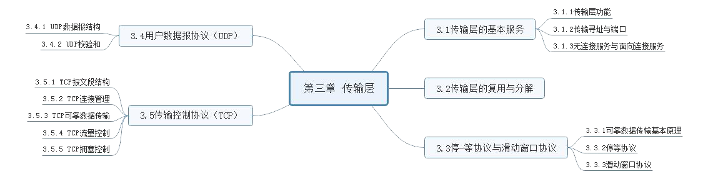
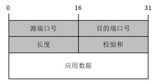
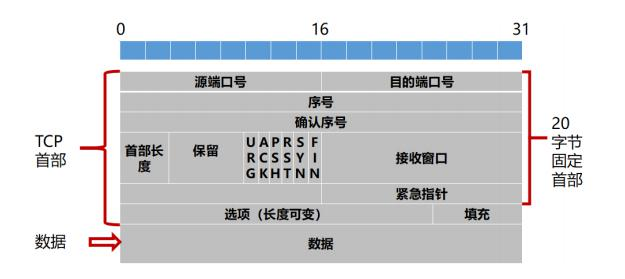

# 第三章 传输层

---

## [第一节] 传输层的基本服务
### 1. `传输层功能`
***核心任务***: 为应用进程之间提供端到端的逻辑通信服务。  
***功能***:
>- 传输层寻址
>- 对应用层报文进行分段和重组
>- 对报文进行差错检测
>- 实现进程间端到端可靠数据传输控制
>- 面向应用层实现复用与分解
>- 实现端到端的流量控制
>- 拥塞控制
>- ...

### 2. `传输寻址与端口`
端口号的分类:
|  熟知端口号 | 登记端口号 | 客户端或暂时端口号 |
|  ----  | ----  | ----  |
| 0 ~ 1023  | 1024 ~ 49151 | 49152 ~ 65535 |

### 3. `无连接服务与面向连接服务`
- UDP:提供无连接服务的传输层协议是
- TCP:提供面向连接服务的传输层协议是
---
## [第二节] 传输层的复用与分解
### 1. `定义`
支持众多应用进程共用同一个传输层协议,并能够将接收到的数据准确交付给不同的应用进程

### 2. `实现复用与分解的关键`
传输层协议能够唯一标识一个套接字

### 3. `无连接的多路复用与多路分解`
- 提供协议: UDP
- 唯一标识: <目的 IP 地址, 目的端口号>

### 4. `面向连接的多路复用与多路分解`
- 提供协议: TCP
- 唯一标识: <源 IP 地址,目的 IP 地址,源端口号, 目的端口号>
---
## [第三节] 停-等协议与滑动窗口协议
### 1. `可靠数据传输基本原理`
- 不可靠传输信道在数据传输中可能发生差错
  - 比特差错
  - 乱序
  - 数据丢失
- 实现可靠数据传输措施
  - 差错检测
  - ACK确认, NAK否定
  - 重传
  - 序号
  - 计时器

### 2. `停-等协议`
停-等协议的基本工作过程是:  
① 发送方发送经过差错编码和编号的报文段,等待接收方的确认  
② 接收方如果正确接收报文段,即差错检测无误且序号正确,则接收报文,并向发送方发送 ACK
③ 否则丢弃报文段,并向发送方发送 NAK  
④ 发送方如果收到 ACK, 则继续发送后续报文段,否则重发刚刚发送的报文段

### 3. `滑动窗口协议`
滑动窗口协议实质上就是将可靠数据传输的工作过程抽象到分组序号空间, 即发送方确保分组按序发送, 接收方确保分组按序提交。  
两种最具代表性的滑动窗口协议
- GBN 协议: 发送窗口 >= 1, 接收窗口 = 1
- SR 协议: 发送窗口 >= 1, 接收窗口 >= 1

### 4. `用户数据报协议(UDP)`
用户数据报协议 UDP 是 Internet 传输层协议, 提供无连接、不可靠、数据报尽力传输服  
UDP 与 TCP 相比,优点有  
- 应用程序更容易控制发送什么数据以及何时发送  
- 无需建立连接  
- 无连接状态
- 首部开销小

#### UDP 数据报结构

#### UDP 效验和
1. 提供了差错检测功能
2. 计算内容包括:UDP 伪首部、UDP 首部和应用层数据
3. 计算规则: 参与运算的内容按 16 位对齐求和, 求和过程中遇到任何溢出(即进位)都被回卷(即进位与和的最低位再加), 最后得到的和取反码

---
## [第五节] 传输控制协议 TCP
TCP 协议特点
- 应用进程要先建立连接
- 每一条 TCP 连接只有两个端点
- 可靠交付,无差错、不丢失、不重复且按序到达
- 全双工通信
- 面向字节流
### 1. `TCP报文段结构`

### 2. `TCP 连接管理`
建立连接(三次握手)
1. 主机 A 向主机 B 发送连接请求段
2. 主机 B 收到 TCP 连接请求段后, 如同意,则发回确认报文段
3. 主机 A 对主机 B 的同意连接报文段进行确认

拆除连接(四次挥手)
1. 主机 A 向主机 B 发送释放连接报文段
2. 主机 B 向主机 A 发送确认段
3. 主机 B 向主机 A 发送释放连接报文段
4. 主机 A 向主机 B 发送确认段

TCP 的序号是对每个应用层数据的每个字节进行编号,确认序号是期望从对方接收数据的字节序号,将已连续收到的应用数据最后一个字节的序号加 1,作为确认序号

### 3. `TCP可靠传输数据`
TCP 的可靠数据传输实现机制包括
- 差错编码
- 确认
- 序号重传
- 计时器等  

TCP 可靠数据传输工作机制
1. 数据分割
2. 启动计时器
3. 校验和检测数据差错
4. 重新排序
5. 丢弃重复报文段
6. 流量控制

造成发送方需要发送和重传事件
1. 从上层应用程序接收数据
2. 定时器超时
3. 收到 ACK

### 4. `TCP 流量控制`
拥塞控制就是通过合理调度、规范、调整网络中发送数据的主机数量、发送频率或数据量,以避免拥塞或尽快消除已发生的拥塞  
TCP 的拥塞控制算法包括了慢启动、拥塞避免、快速重传和快速恢复。  
- 慢启动: 收到一个确认, CongWin 值就加倍(即指数增长的时间段)  
- 拥塞避免: 每经过一个 RTT, 拥塞窗口CongWin 的值就增加 1mss(即线性增长的时间段)  
- 快速重传: 基本思想是接收端接收到 3 次重复确认时, 则推断被重复确认的报文段已经丢失,于是立即发送被重复确认的报文段  
- 快速恢复: 是配合快速重传使用的算法,不在重新从慢启动阶段开始,而是从新的阈值开始,直接进入拥塞避免阶段。具体做法是当发送端连续收到 3 次重复确认时,将阈值减半,并且将拥塞窗口的值置为减半后的阈值, 然后开始执行拥塞避免算法,使 CongWin 缓慢地加性增长