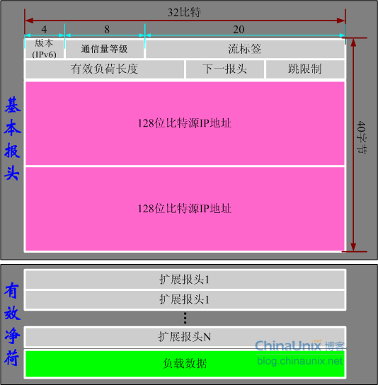

# 第四章 网络层

---
## [第一节] 网络层服务
### 1. `网络层的功能`
转发: 当通过一条输入链路接收到一个分组后, 路由器需要决策通过哪条输出链路将分组发送出去,并且将分组从输入接口转移到输出接口  

路由: 当分组从源主机流向目的主机时, 必须通过某种方式决定分组经过的路由或路径,计算分组所经过的路径的算法被称为路由选择算法,或称为路由算法  

连接建立(分组交换网络): 
- 仅在网络层提供连接的虚电路网络
- 仅在网络层提供无连接的数据报网络

---
## [第二节] 数据报网络与虚电路网络
数据报网络: 按照目的主机地址进行路由选择的网络称为数据报网络  
虚电路网络:  
1. 虚电路网络在网络层提供面向连接的***分组交换服务***。虚电路是在源主机到目的主机的一条路径上建立的一条网络层逻辑连接,称之为虚电路。
2. 一条虚电路由 3 个要素构成。
    - 从源主机到目的主机之间的一条路径
    - 该路径上的每条链路各有一个虚电路标识
    - 该路径上每台分组交换机的转发表中记录虚电路标识的接续关系
3. 虚电路的分组交换有永久型和交换型两种
4. 虚电路交换与数据报交换主要差别表现为: 是将顺序控制、差错控制和流量控制等功能交给网络来完成(虚电路),还是由端系统来完成(数据报)

---

## [第三节] 网络互连与网络互连设备
### 1. `异构网络互连`
异构网络主要是指两个网络的通信技术和运行协议的不同,实现异构网络互连基本策略主要包括协议转换和构建虚拟互连网络 

在网络层实现网络互连的设备是路由器。集线器和中继器都是物理层设备。交换机和网桥是数据链路层设备,交换机就是多端口的网桥,是目前应用最广泛的数据链路层设备

### 2. `路由器`
路由器是最典型的网络层设备
输入端口: 线路端接 -> 数据链路处理(协议、拆封)-> 查找、转发、排队 ->  
交换接口: 基于内存交换、基于总线交换、基于网络交换  
输出端口: -> 排队、缓存管理 -> 数据链路处理(协议、拆封) -> 线路端接  
路由处理器: 转发与路由选择是路由器两项最重要的基本功能

## [第四节] 网络拥塞控制
### 1. `拥塞`
概念: 拥塞是一种持续的过载网络状态,即用户对网络资源的总需求超过了网络固有容量  

原因:   
1. 缓冲区容量有限
2. 传输线路的带宽有限
3. 网络节点的处理能力有限
4. 网络中某些部分发生了故障

### 2. `拥塞控制`
概念: 端系统或节点,采取某些措施来避免拥塞的发生,或者尽快消除已发生的拥塞  

措施:  
- 流量感知: 将网络流量引导到不同的链路上,均衡网络负载,从而避免拥塞发生
- 准入控制: 审核新建虚电路,如果新虚电路会导致网络拥塞,那么网络拒绝建立该新虚电路
- 流量调节: 抑制分组、背压
- 负载脱落: 通过有选择的主动丢弃一些数据报,来减轻网络负载,从而缓解或消除拥塞。

## [第五节] Internet 网络层
### 1. `IPv4协议`
1. IP 数据报格式

2. IP数据报分段

### 2. `IPv4 编址`
1. IPv4 地址有 3 种常用的标记法: 二进制标记法、点分十进制标记法、十六进制标记法  
2. IP地址划分为两部分: 前缀(网络号)和后缀(主机号)。定长前缀为分类地址, 五类地址中网络地址前缀长度可变。

|  类   | 前缀长度  | 前缀| 首字节|
|  ----  | ----  |----  |----  |
| A  | 8 位 | 0xxxxxxxx | 0 ~ 127 |
| B  | 16 位 | 10xxxxxxxx xxxxxxxx| 128 ~ 191|
| C | 24位| 110xxxxx xxxxxxxx xxxxxxxx| 192 ~ 223|
| D | 不可用| 1110xxxx| 224 ~ 239|
| E | 不可用| 1111xxxx| 240 ~ 255|

3. 子网划分: 子网划分就是指将一个子网划分为多个较小子网的过程。超网化是子网划分的逆过程。子网掩码用来定义一个子网的网络前缀长度,是一个 32 位数,取值规则是: 对应网络前缀全部为 1. 其余全部为0。准确描述一个子网有两种形式: CIDR 和 子网地址加子网掩码。
4. 路由聚合: 路由聚合是为了提高路由效率,减少路由表项数,尽可能将能够聚合在一起的子网聚合成一个大的子网。 “下一跳地址” 和 “接口” 相同, 才能聚合。

### 3. `动态主机配置协议`
动态主机配置协议 DHCP 工作过程是:
- DHCP 服务器发现
- DHCP 服务器提供
- DHCP 请求
- DHCP 确认

### 4. `网络地址转换`
NAT 工作原理: 对于从内网出去,进入公共互联网的 IP 数据报,将其源 IP 地址替换为 NAT 服务器拥有的合法的公共 IP 地址, 同时替换源端口号,并将替换关系记录到 NAT 转换表中  
对于从公共互联网返回的 IP 数据报,依据其目的 IP 地址与目的端口号检索 NAT 转换表,并利用检索到的内部私有 IP 地址与对应的端口号替换目的 IP 地址和端口号,然后将 IP 数据报转发到内部网络

### 5. `ICMP`
ICMP 包括 3 个字段: 类型、代码、效验和。  
ICMP 差错报告报文有 5 种
- 终点不可达
- 源点抑制
- 时间超时
- 参数问题
- 路由重定向

IMCP 询问报文
- 回声 echo
- 请求/应答
- 时间戳请求/应答

### 6. `IPv6`
1. 数据报格式

2. IPv6地址包括
- 单播地址: 可以作为 IPv6 数据报的源地址和目的地址
- 组播地址: 只能用作 IPv6 数据报的目的地址, 向一个组播地址发送 IP 数据报,该组播地址标识的多播组每个成员都会收到一个该 IP 数据报的一个副本
- 任播地址: 只能用作 IPv6 数据报的目的地址,但当向一个任播地址发送 IP 数据报时, 只有该任播地址标识的任播组的某个成员收到该 IP 数据报

## [第六节] 路由选择算法与路由协议
|  类别   | 代表性算法  | 基础|
|  ----  | ----  |----  |
|  全局式路由选择算法  | 链路状态路由选择算法  |利用 Dijkstra 算法求最短路径  |
| 分布式路由选择算法| 距离向量路由选择算法| 距离向量路由选择算法的基础是 Bellman-Ford 方程|

层次化路由选择: 实现大规模网络路由选择最有效、最可行的解决方案。每个自治系统都存在网关路由器, 层次化路由选择将大规模互联网的路由划分为两层: 自治系统内路由选择和自治系统间路由选择。

Internet 路由选择协议(层次化路由选择):
- 自治系统内路由选择: RIP、OSPF
- 自治系统间路由选择: BGP