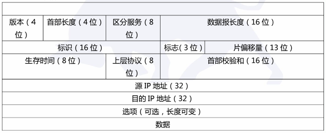
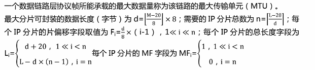

# 第四章 数据链路层与局域网

---
## [第一节] 数据链路层服务
数据链路层提供的服务: 组帧、链路接入、可靠交付、差错控制

---
## [第二节] 差错控制
差错控制: 就是通过差错编码技术, 实现对信息传输差错的检测,并基于某种机制进行差错纠正和处理,是计算机网络中实现可靠传输的重要技术手段,并在许多数据链路层协议中应用。  
  
1. 噪声(导致差错)
    - 随机噪声: 引起随机差错或独立差错
    - 冲击噪声: 指突然发生的噪声。冲击噪声引起的差错称为突发差错。差错通常集中发生在某段信息。突发错误发生的第一位错误与最后一位错误之间的长度称为突发长度
2. 差错控制基本方式:
    - 检错重发
    - 前向纠错(接收端进行、利用纠错编码)
    - 反馈效验
    - 检错丢弃

### 1. `差错编码的基本原理`
在待传输(或待保护)数据信息的基础上, 附加一定冗余信息, 该冗余信息建立起数据信息的某种关联关系,将数据信息以及附加的冗余信息一同发送到接收端, 接收端可以检测冗余信息表征的数据信息的关联关系是否存在,如果存在则没有错误, 否则就是有错误。

### 2. `差错编码的检错与纠错能力`
1. 对于检错编码, 如果编码集的汉明距离 ds = r + 1 ,则该差错编码检测 r 位的差错。
2. 对于纠错编码, 如果编码集的汉明距离 ds = 2r + 1, 则该差错编码可以检测 r 位的差错。

### 3. `典型的差错编码`
奇偶校验码:  
- 奇校验码: 1 位冗余位的取值为 0 或 1, 使得编码后的码字中 1 的个数为奇数
- 偶检验码: 1 位冗余位的取值为 0 或 1, 使得编码后的码字中 1 的个数为偶数

汉明码: 
循环冗余码:
---

## [第三节] 多路访问控制协议
### 1. `信道划分 MAC 协议`
频分多路复用: 频域划分制, 优点分路方便,缺点串扰  
时分多路复用: 时域划分,可分为同步时分多路复用和异步时分多路复用  
波分多路复用: 广泛应用于光纤通信中。
码分多路复用:

### 2. `随机访问 MAC 协议`
ALOHA 协议: 
- 纯 ALOHA: 任何一个站点有数据要发送时就可以直接发送至信道
- 时隙 ALOHA: 把信道时间分成离散的时隙,每个时隙为发送一帧所需的发送时间, 每个通信站只能在每个时隙开始时刻发送帧, 如果在一个时隙内发送帧出现冲突, 下一个时隙以概率 P 重发该帧, 以概率 1 - P 不发该帧,等待下一个时隙, 直到帧发送成功。

CSMA: 
- 非坚持 CSMA: 若通信站有数据发送, 先侦听信道;若发现信道空闲,则立即发送数据;若发现信道忙,则等待一个随机时间, 然后重新开始侦听信道,尝试发送数据;若发送数据时产生冲突,则等待一个随机时间, 然后重新开始侦听信道,尝试发送数据。
- 1-坚持 CSMA: 若通信站有数据发送, 先侦听信道;若发现信道空闲, 则立即发送数据;若发现信道忙,则继续侦听信道直至发现信道空闲, 然后立即发送数据;
- P-坚持 CSMA: 适用于时隙信道。基本原理, 若通信站有数据发送,先侦听信道;若发现信道空闲,则以概率 P 在最近时隙开始时刻发送数据, 以概率 1-P 延迟至下一个时隙发送。若下一个时隙仍空闲,重复此过程,直至数据发出或时隙被其他通信站占用; 若信道忙, 则等待下一个时隙, 重新开始发送过程;若发送数据是发送冲突, 则等待一个随机时间,然后重新开始发送过程。

CSMA/CS: 3种状态, 传输状态、竞争状态、空闲状态

### 3. `受控接入 MAC 协议`
- 集中式控制: 主要方法是轮询技术, 又分为轮叫轮询和传递轮询
- 分散式控制: 最重要的就是对令牌的维护。令牌丢失和数据帧无法撤销, 是环网上最严重的两种错误。

## [第四节] 局域网
### 1. `数据链路层寻址与 ARP`
MAC地址(物理地址、局域网地址):  
1. 两块网络适配器具有不同的 MAC 地址, 用来标识局域网的节点或网络接口。MAC 地址具有唯一性,每个接口对应一个 MAC 地址。
2. MAC 地址长度为 6 字节, 即 48 位。采用十六进制表示法(用 A ~ F 表示 10 ~ 15): 每个字节表示一个十六进制数, “-”或“:” 连接起来。如: 00-2A-E1-76-8C-39 或者 00:2A:E1:76:8C:39
链路层的交换机(第二层交换机)的接口没有相关的链路层地址。

### 2. `地址解析协议 ARP`
作用: 用于根据本网内目的主机或默认网关的 IP 地址获取其 MAC 地址  
基本思想: 在每一台主机中设置专用内存区域, 称为 ARP 高速缓存(也成 ARP 表) 存储该主机所在局域网中其他主机和路由器的 IP 地址与 MAC 地址的映射关系, 并且这个映射表要经常更新。ARP 通过广播 ARP 查询报文,来询问某目的 IP 地址对应的 MAC 地址,即知道本网内某主机的 IP 地址,可以查询得到其 MAC 地址  
注意: ARP 查询分组是通过一个广播帧发送的, 而 ARP 响应分组是通过一个标准的单播帧发送的。

### 3. `以太网`
1. 以太网帧结构  

|  目的地址  | 源地址  | 类型| 数据| CRC |
|  ----  | ----  |----  |----  | --- |
| 6 字节  | 6 字节 | 2 字节| 46~1500 字节 | 4 字节 |

注意: 以太网的最短帧长为 64 字节, 即以太网帧中的数据字段最少要 46 字节(如果不足 46 字节, 则需要填充)

以太网技术:
- 10Base-T 以太网
- 快速以太网
- 千兆位以太网
- 万兆位以太网

### 4. `交换机`
交换机就是多端口网桥, 是目前应用最广泛的数据链路层设备  
交换机的优点是: 消除冲突、支持异质链路、网络管理

### 5. `虚拟局域网`
虚拟局域网是一种基于交换机的逻辑分割广播域的局域网应用形式。  
划分虚拟局域网的方法主要有三种: 基于交换机端口划分、基于 MAC 地址划分、基于上层协议类型或地址划分。

## [第五节] 点对点链路协议
### 1. `PPP`
1. PPP提供的功能: 成帧、链路控制协议、网络控制协议
2. PPP 数据帧结构: 标志、地址、控制、协议、信息、校验和、标志

### 2. `HDLC协议`
1. 帧格式: 01111110, 地址, 控制, 校验和, 01111110
2. HDLC 有 3 种类型的帧: 信息帧、管理帧、无序号帧
3. 零比特填充过程: 发送时, 发现连续5 个 1,即插入一个 0, 收到后, 当发现连续 5 个 1, 就删除其后的 0, 还原信息。

措施:  
- 流量感知: 将网络流量引导到不同的链路上,均衡网络负载,从而避免拥塞发生
- 准入控制: 审核新建虚电路,如果新虚电路会导致网络拥塞,那么网络拒绝建立该新虚电路
- 流量调节: 抑制分组、背压
- 负载脱落: 通过有选择的主动丢弃一些数据报,来减轻网络负载,从而缓解或消除拥塞。

## [第五节] Internet 网络层
### 1. `IPv4协议`
1. IP 数据报格式

2. IP数据报分段

### 2. `IPv4 编址`
1. IPv4 地址有 3 种常用的标记法: 二进制标记法、点分十进制标记法、十六进制标记法  
2. IP地址划分为两部分: 前缀(网络号)和后缀(主机号)。定长前缀为分类地址, 五类地址中网络地址前缀长度可变。

|  类   | 前缀长度  | 前缀| 首字节|
|  ----  | ----  |----  |----  |
| A  | 8 位 | 0xxxxxxxx | 0 ~ 127 |
| B  | 16 位 | 10xxxxxxxx xxxxxxxx| 128 ~ 191|
| C | 24位| 110xxxxx xxxxxxxx xxxxxxxx| 192 ~ 223|
| D | 不可用| 1110xxxx| 224 ~ 239|
| E | 不可用| 1111xxxx| 240 ~ 255|

3. 子网划分: 子网划分就是指将一个子网划分为多个较小子网的过程。超网化是子网划分的逆过程。子网掩码用来定义一个子网的网络前缀长度,是一个 32 位数,取值规则是: 对应网络前缀全部为 1. 其余全部为0。准确描述一个子网有两种形式: CIDR 和 子网地址加子网掩码。
4. 路由聚合: 路由聚合是为了提高路由效率,减少路由表项数,尽可能将能够聚合在一起的子网聚合成一个大的子网。 “下一跳地址” 和 “接口” 相同, 才能聚合。

### 3. `动态主机配置协议`
动态主机配置协议 DHCP 工作过程是:
- DHCP 服务器发现
- DHCP 服务器提供
- DHCP 请求
- DHCP 确认

### 4. `网络地址转换`
NAT 工作原理: 对于从内网出去,进入公共互联网的 IP 数据报,将其源 IP 地址替换为 NAT 服务器拥有的合法的公共 IP 地址, 同时替换源端口号,并将替换关系记录到 NAT 转换表中  
对于从公共互联网返回的 IP 数据报,依据其目的 IP 地址与目的端口号检索 NAT 转换表,并利用检索到的内部私有 IP 地址与对应的端口号替换目的 IP 地址和端口号,然后将 IP 数据报转发到内部网络

### 5. `ICMP`
ICMP 包括 3 个字段: 类型、代码、效验和。  
ICMP 差错报告报文有 5 种
- 终点不可达
- 源点抑制
- 时间超时
- 参数问题
- 路由重定向

IMCP 询问报文
- 回声 echo
- 请求/应答
- 时间戳请求/应答

### 6. `IPv6`
1. 数据报格式

2. IPv6地址包括
- 单播地址: 可以作为 IPv6 数据报的源地址和目的地址
- 组播地址: 只能用作 IPv6 数据报的目的地址, 向一个组播地址发送 IP 数据报,该组播地址标识的多播组每个成员都会收到一个该 IP 数据报的一个副本
- 任播地址: 只能用作 IPv6 数据报的目的地址,但当向一个任播地址发送 IP 数据报时, 只有该任播地址标识的任播组的某个成员收到该 IP 数据报

## [第六节] 路由选择算法与路由协议
|  类别   | 代表性算法  | 基础|
|  ----  | ----  |----  |
|  全局式路由选择算法  | 链路状态路由选择算法  |利用 Dijkstra 算法求最短路径  |
| 分布式路由选择算法| 距离向量路由选择算法| 距离向量路由选择算法的基础是 Bellman-Ford 方程|

层次化路由选择: 实现大规模网络路由选择最有效、最可行的解决方案。每个自治系统都存在网关路由器, 层次化路由选择将大规模互联网的路由划分为两层: 自治系统内路由选择和自治系统间路由选择。

Internet 路由选择协议(层次化路由选择):
- 自治系统内路由选择: RIP、OSPF
- 自治系统间路由选择: BGP