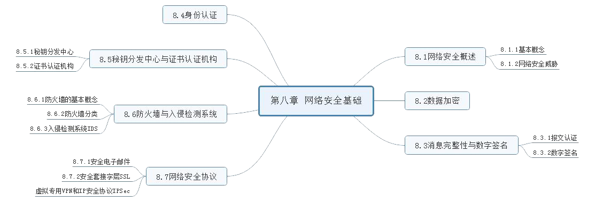
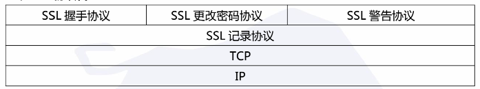

# 第八章 网络安全基础

---
## [第一节] 网络安全概述
### 1. `基本概念`
网络安全所需要的基本属性: 机密性、消息完整性、可访问与可用性、身份认证  
网络安全是指网络系统的硬件、软件及其系统中的数据受到保护, 不因偶然的或者恶意的原因而遭受到破坏、更改、泄露, 系统连续可靠正常的运行,网络服务不中断

### 2. `网络安全威胁`
网络主要面临的威胁有:首先, 从报文传输方面, 主要包括窃听、插入、假冒、劫持等安全威胁。  
比较常见的网络攻击还包括拒绝服务 Dos 以及分布式拒绝服务 DDos 等。其次还包括映射、分组嗅探和 IP 欺骗等

---
## [第二节] 数据加密
### 1. `传统加密方式`
- 替代密码: 是将明文字母表 M 中的每个字母用密文字母表 C 中的相应字母来代替, 常见的加密模型有移位密码、乘数密码、仿射密码等。
- 换位密码: 又称置换密码, 是根据一定的规则重新排列明文, 以便打破明文的结构特性

### 2. `对称秘钥加密`
- DES 加密算法: 典型分组密码, 使用 56 位的秘钥, 明文为 64 位分组序列, 共进行 16 轮的加密, 每轮都进行复杂的替代和置换操作, 并且每轮加密都会使用一个由 56 位秘钥导出的 48 位子秘钥, 最终输出与明文等长的 64 位密文
- 三重 DES: 该方法使用两个秘钥, 执行三次 DES 算法。 加密过程是加密-解密-加密, 解密的过程是解密-加密-解密
- AES 加密: AES 加密过程涉及4 种操作, 字节替代、行移位、列混淆和轮秘钥加
- IDEA: 一个分组长度为 64 位的分组密码算法, 密钥长度为 128 位, 同一个算法即可用于加密, 也可用于解密

### 3. `非对称密钥加密`
比较典型的公开密钥加密算法有 Diffie-Hellman 算法和 RSA 算法

---

## [第三节] 消息完整性与数字签名
### 1. `报文认证`
消息完整性检测的一个重要目的就是要完成报文认证的任务。对报文应用散列函数, 得到一个固定长度的散列码, 称为报文摘要。  
报文认证的目的有两个
- 消息源的认证, 即验证消息来源是真实的
- 消息认证,即验证消息在传送过程中未被篡改

### 2. `数字签名`
报文完整性认证过程中, 数字签名是有效的技术手段。数字签名就是用私钥进行加密, 而认证就是利用公开密钥进行正确的解密, 所以报文加密技术是数字签名的基础。数字签名包括简单数字签名和签名报文摘要。

---
## [第四节] 身份认证
身份认证又称身份鉴别, 是一个实体经过计算机网络向另一个实体证明其身份的过程
---
## [第五节] 秘钥分发中心与证书认证机构
### 1. `秘钥分发中心`
对称秘钥分发的典型解决方案是, 通过各方建立一个大家都信赖的秘钥分发中心, 并且每一方和 KDC 之间都保持一个长期的共享密码

### 2. `证书认证机构`
将公钥与特定实体绑定, 通常是由认证中心 CA 完成的。  
CA 具有以下作用
- CA 可以证实一个实体的真实身份
- 一旦 CA 验证了某个实体的身份, CA 会生成一个把其身份和实体的公钥绑定起来的证书, 其中包含该实体的公钥及其全局唯一的身份识别信息等, 并由 CA 对证书进行数字签名
---
## [第六节] 防火墙与入侵检测系统
### 1. `防火墙的基本概念`
防火墙是能够隔离组织内部网络与公共互联网, 允许某些分组通过, 而阻止其他分组进入或离开内部网络的软件、硬件或者软件硬件结合的一种设施

### 2. `防火墙的分类`
防火墙大致可以分为三类
- 无状态分组过滤器: 是典型的部署在内部网络和网络边缘路由器上的防火墙
- 有状态分组过滤器和应用网关

### 3. `入侵检测系统 IDS`
入侵检测系统是当观察到潜在的恶意流量时, 能够产生警告的设备或系统

---

## [第七节] 网络安全协议
### 1. `安全电子邮件`
电子邮件对网络安全的需求: 机密性、完整性、身份认证性、抗抵赖性  
安全电子邮件标准是 PGP 标准

### 2. `安全套接字层 SSL`
1. 安全套接字层 SSL 是由 NetScape 最先实现,并广泛部署的安全协议, 几乎所有浏览器和 Web 服务器都支持
2. 简化的 SSL 主要包含 4 部分
    - 发送方和接收方利用各自证书、私钥认证、鉴别彼此, 交换共享密钥
    - 密钥派生或密钥导出
    - 数据传输
    - 连接关闭

### 3. `SSL 协议栈`    

注意: SSL 使用的加密算法:公开密钥加密算法、对称密钥加密算法、MAC 算法

### 3. `虚拟专网 VPN 和 IP 安全协议 IPSec`
1. VPN 简介: VPN关键技术,隧道技术、数据加密、身份认证、密钥管理、访问控制和网络管理
    - 隧道协议包括: 乘客协议、封装协议、承载协议

2. IPsec 体系简介
    - IPSec两种典型的传输模式: 传输模式和隧道模式
    - 主要包括封装安全载荷协议 ESP、认证头 AH 协议、 安全关联 SA、密钥交换与管理 IKE
    - 安全关联SA: 在 SA 建立时需要维护很多参数, 主要有以下几个: 安全参数索引, 序列号,抗重放窗口,生存周期, 运行模式, IPSec 隧道源和目的地址
    - AH协议和 ESP: AH、ESP 两种不同协议和两种模式(传输模式、隧道模式)结合起来共有 4 种组合: 传输模式 AH、隧道模式 AH、传输模式 ESP、隧道模式 ESP
    - IPSec 密钥交换 IKE  
    IPSec 进行自动协商建立安全关联和交换密钥的方式就是互联网密钥交换协议 IKE  
    IKE 自动管理 SA 的建立、协商、修改和删除, 是 IPSec 唯一的秘钥管理协议。  
    IKE 包括3个主要部分
        - 互联网安全关联与密钥管理协议
        - 密钥交换协议 OAKELY
        - 共享和密钥更新技术 SKEME提供了 IKE 交换密钥的算法